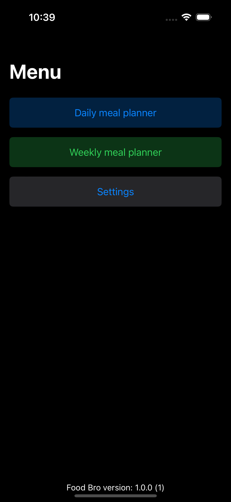

# FOOD BRO 

## Requirements

- iOS 16.0+
- Xcode 15.0

## Installation

 #### Clone GitHub repository with XCode
 - Open your XCode application. Go to the Source Control Tab of XCode and go to Clone.
 - Enter the repository URL you copied in the above step in the search bar at the top of the dialog and hit the Clone button.
 - Choose a location to save your cloned repository and hit the Clone button.
 - Run the app in Simulator (by press play button)

 #### Clone GitHub repository manually
 - clone repository
 - open in XCode file -> Food Bro.xcodeproj
 - Run the app in Simulator (by press play button) 

For more information look the [documentation](https://developer.apple.com/documentation/xcode/running-your-app-in-simulator-or-on-a-device#)

## Plan your ideal diet in a few easy steps

 #### Step 1 - choose your options

 #### Step 2 - specify the parameters of your person
 

 #### Step 3 - enter your food preferences
 

 #### Step 4 - enter your food allergies
 

 #### Step 5 - enter your sports or nutrition goals
 

 #### Step 6 - Done your diet is ready 
 
